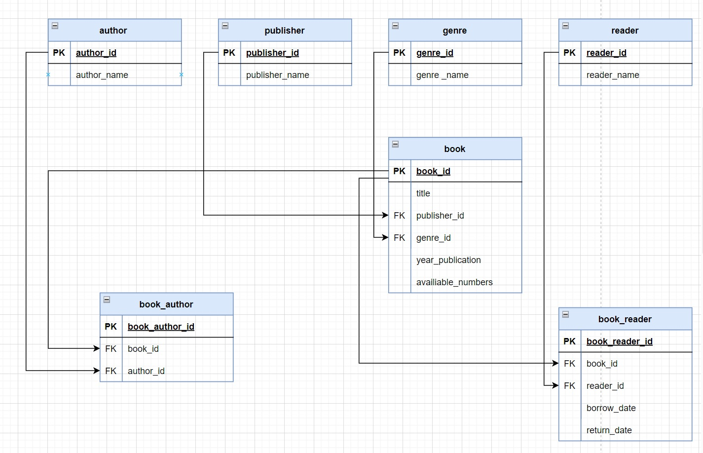

# Схема отношений

# Запросы, которые были выполнены в рамках проекта
1. Вывести детективы, изданные позже 2016. Указать их издательство и год издания. Информацию отсортировать сначалапо убыванию года издания, потом по названиям книг в алфавитном порядке.
2. Для каждого жанра посчитать, сколько различных книг этого жанра представлено в библиотеке, каково общее количество доступных экземпляров книг (имеющихся в наличии) и какой самый ранний год издания книг, относящихся к этому жанру. Информацию отсортировать по названию жанра в алфавитном порядке.
3. Вывести информацию о всех книгах, который сдал заданный читатель. Для каждой книги указать дату выдачи, дату сдачи и сколько дней книга была на руках. Информацию отсортировать по убыванию количества дней
4. Вывести самый популярный жанр (жанры). Самым популярным считается жанр, книги которого чаще всего брали читатели в библиотеке. Вывести название жанра (жанров) и сколько раз читатели брали книги этого жанра. Информацию отсортировать по названию жанров в алфавитном порядке.
